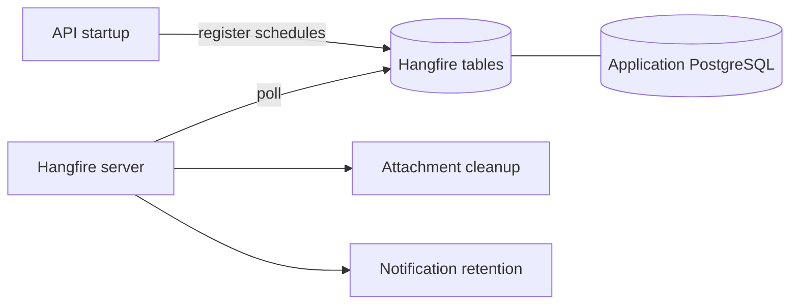

# Background jobs

> Type: operations
> Scope: backend
> Status: implemented
> Canonical for: Hangfire runtime, recurring jobs, and production ownership

## Runtime

Hangfire stores state in the application database from `ConnectionStrings:DefaultConnection`. The API registers recurring jobs at startup; hosts with `HangfireOptions:ServerEnabled=true` execute them.

## Settings

| Setting | Default | Purpose |
| --- | --- | --- |
| `HangfireOptions:ServerEnabled` | `true` | Run workers on this host |
| `HangfireOptions:DashboardEnabled` | `false` | Expose the dashboard; Development overrides to `true` |
| `HangfireOptions:DashboardPath` | `/hangfire` | Dashboard path |

The template does not authenticate the dashboard. Keep it disabled in production unless a reverse proxy, network policy, or Hangfire authorization filter restricts access.

## Recurring jobs

| Job ID | Schedule setting | Default | Purpose |
| --- | --- | --- | --- |
| `attachment-storage-cleanup` | `FileStorageOptions:CleanupCronExpression` | `0 * * * *` | Remove orphaned stored files |
| `notifications-retention-cleanup` | `NotificationRetentionOptions:CleanupCronExpression` | `0 3 * * *` | Purge old in-app notifications |

Cron values use five fields: minute, hour, day, month, weekday. Restart the API after a schedule change so registration runs again.

## Production invariants

- Include Hangfire tables in application database backup and restore.
- Run at least one API instance with the server enabled.
- HTTP-only replicas may disable the server; duplicate workers are safe only for jobs designed for distributed execution.
- Use the dashboard to inspect failures, then fix the underlying cause before retrying.

Attachment reconciliation details: [file storage](file-storage.md). Deployment checklist: [system deployment](../../../system/operations/deployment.md).
