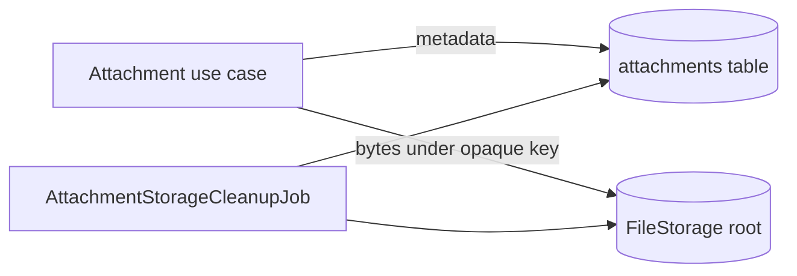

# File storage

> Type: operations
> Scope: backend
> Status: implemented
> Canonical for: attachment byte storage, reconciliation, retention, and backup

## Storage model



Attachment metadata lives in the shared `attachments` table using TPH inheritance. File bytes live below `FileStorage:RootPath`; user file names are metadata and are never used as paths.

```text
{RootPath}/
  {container}/
    {ownerId}/
      {storageKey}
```

For issue attachments the container is `Issue`, the owner is the issue ID, and `storageKey` is a server-generated GUID.

## Configuration

| Setting | Default | Purpose |
| --- | --- | --- |
| `FileStorage:RootPath` | `../../storage` | Root for stored bytes |
| `FileStorage:CleanupCronExpression` | `0 * * * *` | Orphan reconciliation schedule |
| `FileStorage:CleanupConcurrentExecutionTimeoutSeconds` | `3600` | Prevent overlapping cleanup jobs |

Docker Compose mounts a named volume at `/app/storage` and sets `FileStorageOptions__RootPath=/app/storage`.

Upload count, size, and extension rules belong to domain constraints such as `IssueConstraints`, not storage options. `IFileContentValidator` performs content inspection.

## Consistency and retention

- Uploads write bytes before the single database commit. If the use case fails before commit it deletes the written file.
- If the process or database commit fails after the write, `AttachmentStorageCleanupJob` removes bytes without matching metadata.
- Deleting an attachment or its owning aggregate removes its metadata and stored bytes.
- Files remain until explicit deletion; the cleanup job is reconciliation, not business retention.

## Backup invariant

Back up the application database and `FileStorage:RootPath` as one consistency set. Restoring only metadata creates broken downloads; restoring only bytes creates orphans that cleanup will remove.

For cloud deployments, replace `IFileStorageService` with object storage while preserving opaque keys, server-side content validation, and metadata ownership.

## Verification

Integration tests cover upload, download, validation, authorization, and deletion. Use the Hangfire dashboard to verify cleanup registration and failures; see [background jobs](background-jobs.md).
