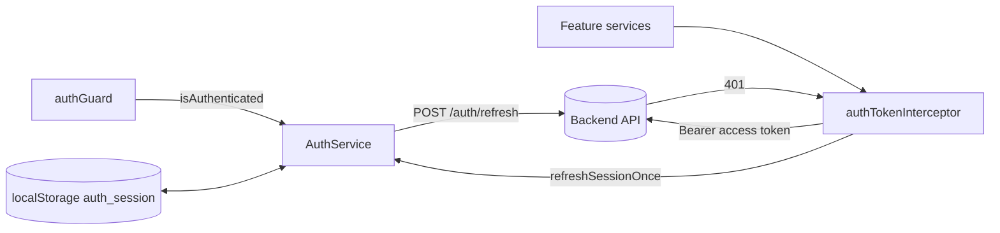
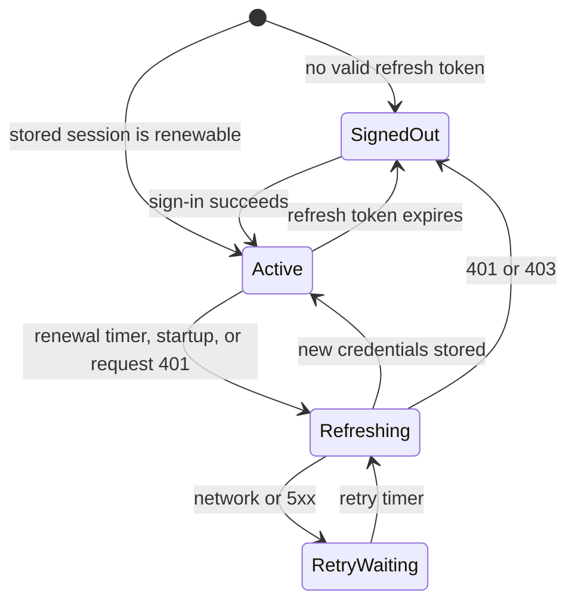
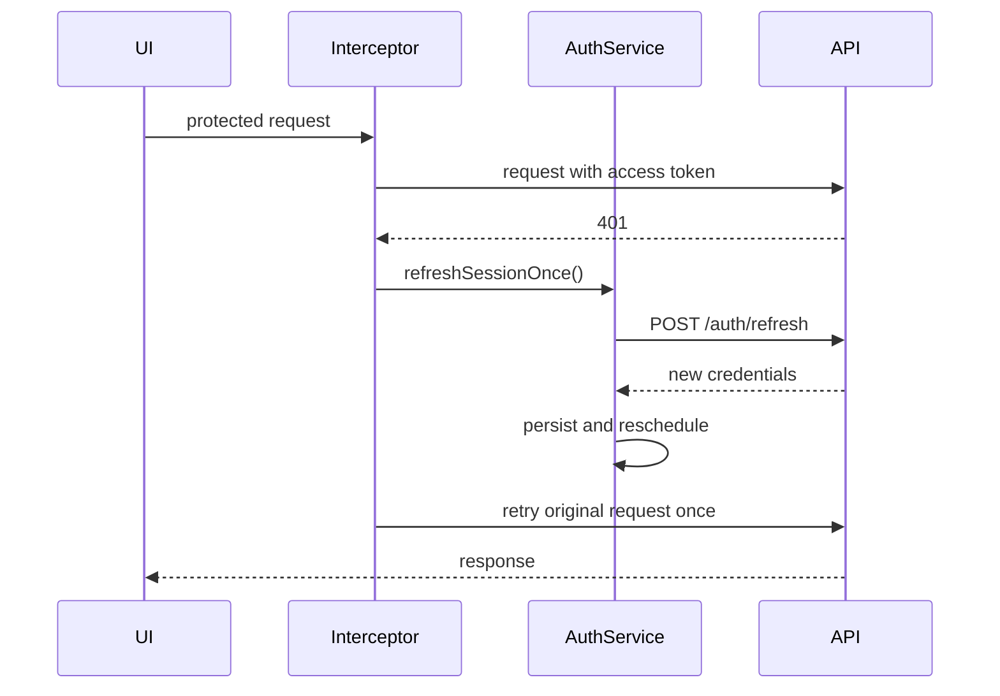

# Auth session lifecycle

> Type: architecture
> Scope: frontend
> Status: implemented
> Canonical for: Angular session state, credential renewal, and refresh failure handling
> Product behaviour: [FR-AUTH-002](../../../requirements/functional/identity/fr-auth-002-staying-signed-in.md)
> Code: `src/ChangeMe.Frontend/src/app/features/auth/`

## Summary

- `AuthService.isAuthenticated()` follows refresh-token validity, not access-token validity.
- Renewal starts before access-token expiry, on application startup when needed, or after a protected request returns `401`.
- A protected request gets at most one renewal and one retry.
- Network and server failures preserve the local session and schedule another attempt.
- An expired, revoked, forbidden, or deactivated session clears local state and returns the user to sign-in.

Credential lifetimes, browser persistence, and sign-out rules are canonical in `FR-AUTH-002`. This document owns only the frontend mechanism.

## Components

`AuthStorageService` is the only owner of persisted session reads and writes. The interceptor owns request attachment and the single retry. `AuthService` serializes concurrent refresh attempts and owns renewal scheduling.

## Lifecycle

The retry wait is an implementation recovery state: the user remains authenticated according to the stored refresh token, while API calls may still fail until renewal succeeds.

## Request renewal

Refresh calls carry `X-Skip-Auth-Refresh`, preventing the interceptor from recursively refreshing its own failed request.

## Decisions and invariants

| Decision | Rationale | Consequence |
| --- | --- | --- |
| Authentication follows refresh-token validity | The access token is deliberately short lived | An expired access token does not immediately sign the user out |
| Refresh errors retain HTTP status | Status distinguishes unavailable API from invalid session | `postRefresh()` does not use generic error conversion that loses status |
| Transient refresh failure keeps the session | Temporary API failure is not a revoked session | Retry is scheduled with `TRANSIENT_REFRESH_RETRY_MS` |
| Auth refresh failure clears the session | Renewal is no longer allowed | Guards and navigation return to sign-in |
| Refresh is single-flight | Several requests may fail together | All callers share one renewal instead of issuing parallel refresh calls |
| A failed protected request retries once | Prevent retry loops and duplicated mutations | A second `401` reaches the caller |

## Failure handling

| Condition | Frontend response | Verification |
| --- | --- | --- |
| Network error (`status: 0`) or `5xx` during refresh | Keep session; retry later | `auth-session.utils.spec.ts`, `auth.service.spec.ts` |
| Refresh returns `401` or `403` | Clear session; redirect to sign-in | service and interceptor tests |
| Stored refresh token expired | Clear local session without renewal | storage/service tests |
| Retried API request fails | Return the error; do not refresh again | interceptor tests |

Classification lives in `utils/auth-session.utils.ts`. Scheduling constants live in `utils/auth.utils.ts`; product-defined timing remains canonical in `FR-AUTH-002`.

## Code map

| File | Responsibility |
| --- | --- |
| `services/auth.service.ts` | Session signal, single-flight refresh, startup initialization, timer |
| `services/auth-storage.service.ts` | Persist and read the browser session |
| `interceptors/auth-token.interceptor.ts` | Attach access token; one refresh and retry after `401` |
| `utils/auth-session.utils.ts` | Token lifetime and refresh-error classification |
| `utils/auth.utils.ts` | Renewal and retry scheduling constants |
| `guards/auth.guard.ts` | Route access based on `isAuthenticated()` |

## Verification

- Frontend unit tests cover startup, renewal, concurrent refresh, transient failure, auth failure, and interceptor retry.
- Backend integration tests remain canonical for refresh endpoint authorization and session revocation.
- E2E is required only when the browser-visible sign-in or session journey changes; see [testing strategy](../../../system/development/testing-strategy.md).
