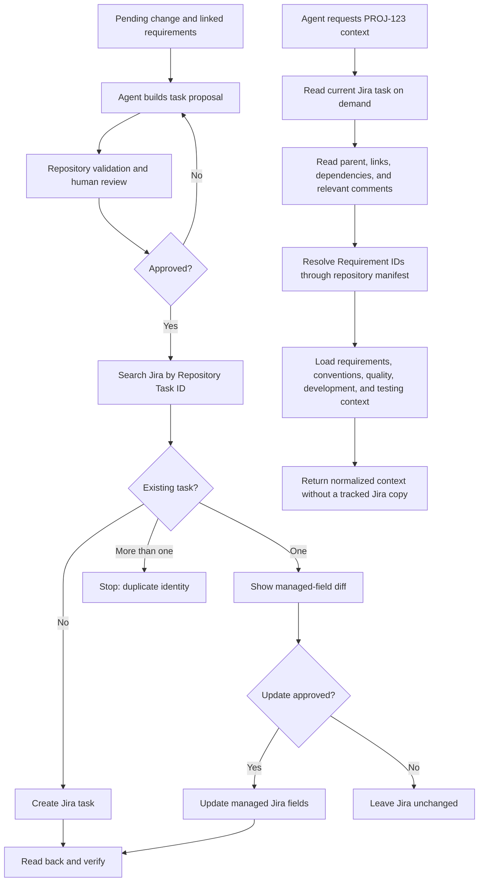

# Jira task-management integration

> Type: design
> Scope: system
> Status: proposed
> Canonical for: repository-driven Jira task creation, live task context for AI agents, and controlled Jira updates during the current task-management phase

## Goal

Use Jira as the single source of truth for delivery tasks while keeping product requirements and implementation guidance in this repository. Analysts and AI agents should be able to turn an approved requirement change into a reviewable Jira task proposal. Agents should then read the latest Jira state on demand, combine it with the canonical repository context, and create or update Jira work only through explicit, auditable operations.

This phase does not implement automatic reactions to Jira status changes, local agent orchestration, autonomous implementation, sandbox execution, Slack routing, or GitLab review automation. Those capabilities belong to the separately deferred local-agent environment design.

## Source-of-truth boundaries

| Information | Canonical source |
| --- | --- |
| Product behavior, domain rules, `FR-*`, `NFR-*`, and `STD-*` | Repository requirements |
| Pending behavior delta and implementation scope | Repository change record |
| Task description, task-specific acceptance criteria, priority, assignee, sprint, status, and comments | Jira |
| Implementation, history, and reviewable change | Git and GitLab |
| Merge request, pipeline, and deployment evidence | GitLab, linked into Jira |
| Agent-generated task proposal before approval | Temporary local artifact |

The integration must not mirror Jira tasks, comments, statuses, assignees, or sprint data into tracked repository files. A local cache is not required for normal operation and must never be treated as current Jira state.

## Target flow



## Decisions

### Keep Jira tasks out of the repository

There is no Jira-to-Git task synchronization. Agents retrieve only the requested task and the directly relevant Jira graph, such as its parent, blocking or blocked-by links, child tasks, and decision-bearing comments.

The preferred interactive path is direct Jira access through the Atlassian connector. A repository command provides a provider-neutral fallback and a stable interface for future agents:

```powershell
npm run jira:context -- PROJ-123
```

The command writes normalized JSON or Markdown to standard output. It does not persist the task. An optional short-lived cache may be added later only for rate limiting or large attachments, with an explicit TTL and a fresh read before every create or update decision.

### Keep proposals temporary

Task proposals may be written under the already ignored `artifacts/jira/` directory when a file is useful for review or bulk creation. That directory contains only proposed outbound work, never a downloaded Jira backlog. A proposal stops being authoritative as soon as Jira work is created.

### Correlate without copying

Every repository-generated task has a stable `Repository Task ID`, for example:

```text
template:2026-08-account-deactivation:backend-api
```

Before creation, the integration searches Jira for this identifier:

1. no result means create;
2. exactly one result means compare integration-owned fields;
3. more than one result is a duplicate-identity error requiring manual resolution.

Jira remains responsible for its own key such as `PROJ-123`. The repository identifier provides idempotency across retries and agent sessions; it does not replace the Jira key.

### Link tasks to canonical repository context

The minimum proposed Jira metadata is:

| Field | Purpose |
| --- | --- |
| `Repository Task ID` | Stable, JQL-searchable automation identity |
| `Requirement IDs` | One or more `FR-*` identifiers used to resolve canonical requirements |
| `Source revision` | Git commit SHA from which the task proposal was derived |
| `Change record` | Repository URL or path for the pending delta, when applicable |
| `Repository` | Repository identity or canonical URL |

The task description contains the outcome, in-scope and out-of-scope behavior, task-specific acceptance criteria, verification expectations, and open questions. It links requirements instead of copying complete `FR-*`, `NFR-*`, or convention documents.

The existing generated `docs/requirements/.requirements-manifest.json` resolves `Requirement IDs` to repository files. The context builder follows `depends_on`, `inherits_conventions`, and `inherits_quality`, then adds the relevant module development and testing documents based on task scope.

### Use live reads and controlled writes

Agent permissions follow this policy during the current phase:

- reading visible Jira project metadata, tasks, links, and comments may happen without per-read approval;
- producing a proposal or diff does not mutate Jira;
- creating tasks requires explicit approval of the proposal;
- editing analyst-owned task content requires an explicit diff and approval;
- adding an informational comment may be allowed by the calling workflow, but must be attributable;
- deleting tasks and automatic terminal workflow transitions are not supported.

Interactive agents should use user-scoped OAuth through the Atlassian connector. Deterministic repository or CI automation should use a separate least-privilege service identity. Credentials remain outside Git and outside agent-generated artifacts.

### Assign field ownership

| Jira data | Owner | Integration behavior |
| --- | --- | --- |
| `Repository Task ID`, requirement links, repository link, source revision | Repository integration | Create and update after validation |
| Outcome, scope, acceptance criteria, product questions | Analyst, optionally agent after approval | Never overwrite silently |
| Technical notes and verification proposal | Developer or agent after approval | Apply as a reviewed diff or comment |
| Priority, assignee, sprint, status | Jira team workflow | Read only in this phase unless the user explicitly requests a change |
| Branch, commit, MR, pipeline, deployment | GitLab integration | Link by Jira key; do not duplicate into repository task files |

Automated synchronization updates only integration-owned fields. It reports changes to analyst-owned text rather than overwriting them.

### Detect requirement drift instead of auto-rewriting tasks

When the current requirement revision differs from `Source revision`, the integration reports that the Jira task may be stale. It must not automatically replace task content. The analyst or developer reviews the requirement delta, asks the agent to re-plan, and approves any Jira update.

An update operation reads Jira immediately before showing the final diff and reads it back after writing. If relevant Jira content changed between planning and application, the operation stops and requires a refreshed proposal.

### Use the agreed Jira-key convention in Git

Commit messages and merge request titles use:

```text
[PROJ-123] Description of the change
```

Branch names use the shell- and URL-friendly form:

```text
PROJ-123-short-description
```

The Jira-GitLab integration uses the Jira key to associate development and pipeline evidence with the task.

## Proposed repository contract

The exact file names may be refined during implementation, but the planned responsibilities are:

| Path or command | Responsibility |
| --- | --- |
| `.jira/config.yml` | Tracked non-secret Jira project, work-type, field, label, and repository mapping |
| `.jira/task-proposal.schema.json` | Machine-readable validation contract for task proposals |
| `artifacts/jira/` | Ignored, disposable outbound proposals and apply reports |
| `scripts/jira/*.mjs` | Jira client, context resolver, proposal validator, diff, and apply logic |
| `npm run jira:doctor` | Verify authentication, site, project, work types, fields, and permissions without mutation |
| `npm run jira:tasks:plan` | Build a proposal from a pending change and linked requirements |
| `npm run jira:tasks:validate` | Validate proposal structure and repository references without contacting or mutating Jira where possible |
| `npm run jira:tasks:apply` | Search, diff, create or update after explicit approval, then read back |
| `npm run jira:context -- PROJ-123` | Return fresh Jira plus repository context without persisting a task copy |
| `npm run jira:check -- PROJ-123` | Detect missing references, duplicate identity, and source-revision drift |

Every executable script must begin with the repository-required purpose comment. Shared logic should be covered by unit tests; external calls should be isolated behind a client boundary so validation, context resolution, and diff behavior can be tested without a Jira site.

## Task proposal contract

A proposal needs enough structure for validation and idempotent application:

```yaml
repository_task_id: template:2026-08-account-deactivation:backend-api
type: Task
summary: Implement account deactivation endpoint
parent_repository_task_id: template:2026-08-account-deactivation
requirement_ids: [FR-USR-005, FR-ROL-001]
scope: [backend]
outcome: An administrator can deactivate an eligible account.
acceptance_criteria:
  - The endpoint enforces the effective permission requirement.
verification:
  - npm run test:backend:integration
depends_on: []
```

The validator checks identifiers, referenced requirements, parent relationships, dependency cycles, required acceptance criteria, allowed scopes and work types, and verification coverage. Semantic quality remains a human and agent review responsibility.

## Failure handling

| Condition | Expected behavior |
| --- | --- |
| Jira unavailable | Fail without creating a local substitute source of truth; retain only the outbound proposal |
| Authentication or permission failure | `jira:doctor` reports the missing capability and no write is attempted |
| Duplicate `Repository Task ID` | Stop and require manual Jira cleanup or identity correction |
| Unsupported Jira field or work type | Stop before bulk creation and report project metadata differences |
| Requirement changed since proposal | Mark the proposal stale and require regeneration or explicit review |
| Jira task changed before update | Refetch, discard the old diff, and require renewed approval |
| Partial parent/child creation | Produce an apply report and safely resume by stable identifiers; never blindly recreate successful work |
| Missing Atlassian connector | Use the repository Jira client for on-demand context; do not export the backlog |

## Delivery phases

1. **Jira contract:** confirm Jira Cloud site, project type, work types, workflow, required fields, custom-field availability, service identity, and GitLab integration.
2. **Repository foundation:** add non-secret configuration, proposal schema, validation, tests, purpose-comment-compliant scripts, and `jira:doctor`.
3. **Task creation:** generate proposals from pending changes, review them, apply idempotently, support parent/child ordering, and verify created work by read-back.
4. **Live agent context:** implement `jira:context`, Jira graph selection, requirement-manifest resolution, and provenance in the returned context.
5. **Controlled updates:** implement managed-field diffing, drift detection, concurrency checks, and explicit approval for edits.
6. **GitLab linkage:** validate `[PROJ-123]` commit and merge request conventions and confirm Jira development information is visible.
7. **Operational hardening:** add rate-limit handling, retries with idempotency, credential rotation documentation, audit-friendly logs, and recovery tests for partial bulk operations.

## Decisions required before implementation

- Jira Cloud site and project key;
- company-managed versus team-managed Jira project and available work types;
- final custom-field names and IDs;
- whether the parent delivery item is an Epic, Story, or project-specific work type;
- who approves task proposals and which informational comments agents may add without a second approval;
- whether task creation runs only locally or may also be invoked by a manual protected CI job;
- retention period for disposable proposals and apply reports;
- exact Atlassian connector and service-account permission boundaries.

## Verification

Before marking this design implemented:

1. Generate a multi-task proposal from one pending change without Jira mutation.
2. Reject an invalid `FR-*`, cyclic dependency, unsupported work type, and duplicate repository identifier.
3. Create the approved tasks, repeat the same apply operation, and prove that no duplicate task is created.
4. Request context for one Jira key and prove that only relevant live Jira work and repository documents are returned without a tracked task copy.
5. Change the linked requirement and prove that drift is reported without silently rewriting Jira.
6. Change Jira content between proposal and update and prove that the stale update is stopped.
7. Confirm that credentials and Jira payloads are absent from tracked files and proposal logs.
8. Confirm GitLab associates `[PROJ-123]` development activity with the correct Jira task.

## Related documents

- [Requirements change process](../../requirements/requirements-change-process.md)
- [Requirements authoring guide](../../requirements/requirements-authoring-guide.md)
- [Cross-module feature workflow](../development/feature-workflow.md)
- [Testing strategy](../development/testing-strategy.md)
- [Continuous integration](../operations/ci.md)
- [Jira Cloud REST API](https://developer.atlassian.com/cloud/jira/platform/rest/v3/intro/)
- [Atlassian Rovo MCP Server](https://support.atlassian.com/atlassian-ai-gateway/docs/use-atlassian-rovo-mcp-server/)
- [GitLab integration with Jira](https://support.atlassian.com/jira-cloud-administration/docs/integrate-gitlab-with-jira/)

