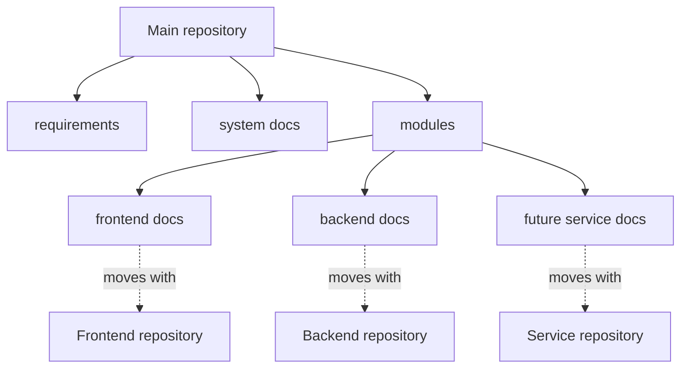

# Modular documentation migration

> Type: design
> Scope: system
> Status: implemented
> Canonical for: preparing documentation for frontend, backend, and future service repository extraction

## Goal

Make documentation movable with its owning module while keeping product requirements and cross-module knowledge in the main repository. The migration must reduce duplicate facts and preserve short, predictable reading paths for people and AI agents.

## Target ownership

The main repository retains:

- `docs/requirements/` — product behaviour and requirement workflow;
- `docs/system/` — cross-module development, architecture, designs, and operations;
- the documentation index and shared documentation rules.

Each `docs/modules/<module>/` subtree is a future extraction unit. After extraction its contents become that repository's `docs/` without changing their responsibility.

## Migration map

| Previous document | Target |
| --- | --- |
| `guides/repo-map.md` | `system/development/repository-map.md` |
| `guides/testing-guidelines.md` | `system/development/testing-strategy.md` |
| `guides/e2e-guidelines.md` | `system/development/e2e-testing.md` |
| `guides/feature-recipes.md` | `system/development/feature-workflow.md` |
| `guides/frontend-guidelines.md` | `modules/frontend/development.md` |
| `guides/backend-guidelines.md` | `modules/backend/development.md` |
| `architecture/auth-session-flow.md` | `modules/frontend/architecture/auth-session-lifecycle.md` |
| `technical/deployment.md` | `system/operations/deployment.md` |
| `technical/ci.md` | `system/operations/ci.md` |
| `technical/publishing.md` | `maintainer/publishing.md` |
| `technical/data-generator.md` | `modules/backend/demo-data.md` |
| `technical/database-and-docker.md` | split by owner; see below |

The mixed database and Docker document becomes:

- `system/operations/local-stack.md` — Compose and local full-stack configuration;
- `modules/backend/operations/persistence.md` — PostgreSQL and EF Core migrations;
- `modules/backend/operations/background-jobs.md` — Hangfire;
- `modules/backend/operations/file-storage.md` — attachment storage and backup.

## Phases

| Phase | Outcome | Status |
| --- | --- | --- |
| 1. Classification | Ownership, naming, and document-shape rules recorded | Implemented |
| 2. Repository migration | Existing docs moved and mixed concerns split | Implemented |
| 3. Link migration | Indexes, agent routing, templates, comments, and requirement links updated | Implemented |
| 4. Verification | Old paths absent, links valid, requirements validation passes | Implemented |
| 5. Repository extraction | Module directories move into separate repositories | Planned |

## Extraction rules

When a module is extracted:

1. Move `docs/modules/<module>/` into the new repository as `docs/`.
2. Move module-specific `AGENTS.md` rules with the code; keep cross-repository routing in the main repository.
3. Replace relative cross-repository links with stable repository links.
4. Keep requirements canonical in the main repository; module docs link to the relevant version.
5. Keep integration and E2E ownership in the main repository unless the test and all dependencies move together.
6. Do not retain copied module documents in the main repository.

Documentation conventions are defined in [`docs/documentation-rules.md`](../../documentation-rules.md).
