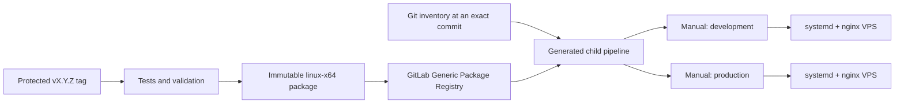

# Multi-environment application delivery

> Type: design
> Scope: system
> Status: implemented
> Canonical for: rationale behind immutable application packages, versioned environment definitions, and manually selected native VPS deployments

## Goal

Build an application version once, then let an operator independently decide whether the exact package is deployed to development or production. Keep non-secret instance configuration reviewable in Git, keep secrets on each VPS, and use the same automation without Docker on deployed environments.

## Decision

- A protected stable tag matching `vX.Y.Z` runs verification and creates one deterministic, self-contained `linux-x64` archive.
- GitLab's Generic Package Registry stores the archive, its external SHA-256 file, and a manifest copy. Publishing refuses to replace an existing asset with different bytes.
- A generated child pipeline exposes one blocking manual job for every enabled inventory host. Creating a package never starts a deployment.
- A later branch pipeline may select an existing package version, so configuration can advance without rebuilding application source.
- Ansible owns bootstrap, configuration revisions, activation, health checks, retention, and rollback. Custom Bash is limited to deterministic package assembly and its contract test.
- Docker Compose remains a local-development tool. VPS instances use systemd, nginx, and an externally managed PostgreSQL service.
- Non-secret configuration lives in versioned Ansible host variables. Secret values live only in a root-owned `0600` file on the target server.
- One VPS is treated as one application instance in the supported baseline. Ubuntu 24.04 and Debian 12 on x86-64 are the initial targets.



## Package and configuration identity

The archive contains `backend/`, `frontend/`, `manifest.json`, and `checksums.sha256`. The manifest records the application package name, semantic version, full source commit, runtime identifier, deterministic timestamp, source pipeline URL, and migration-set digest. The archive's own checksum is stored beside it because an archive cannot contain a checksum of its final bytes.

The package contains no environment settings, secrets, host names, TLS material, or environment-specific files. A deployment is identified by both:

```text
application package version + package SHA-256 + configuration Git commit
```

Host variables own public URLs, SSH topology, runtime config, and GitLab environment names. The deployment generator rejects unknown runtime keys, secret keys in Git, unsafe managed paths, duplicate environment names, invalid hosts, and enabled example values.

## Server and trust model

The active application and configuration are independent symlinks:

```text
/opt/<application>/releases/<version>/
/opt/<application>/current
/opt/<application>/previous
/etc/<application>/config-revisions/<commit>/
/etc/<application>/current-config
/etc/<application>/previous-config
/etc/<application>/secrets.env
```

The service loads `current-config/backend.config.env` first and `secrets.env` second. nginx serves the active frontend and the active `frontend-runtime.js`, while systemd starts the self-contained backend on loopback.

The dedicated deployment SSH account can become root without a password because routine Ansible changes systemd, nginx, `/opt`, and `/etc`. Its private key is therefore an administrative credential. It must be stored as a protected, environment-scoped GitLab file variable; the production environment must be protected and should require approvals when the GitLab tier supports them. Public deployment keys are versioned in inventory.

The deployment pipeline never reads, transfers, changes, or prints secret values. It validates only the target file's ownership, permissions, syntax, allowed key names, and presence of required non-empty keys.

## Activation and recovery

An atomic lock directory serializes activation on a VPS in addition to GitLab's per-instance `resource_group`. Deployment verifies the controller and remote archive checksum, internal file checksums, manifest, configuration revision, and backend executable before activation.

The selected configuration is activated, then the new backend runs once with `--migrate-only`. Only after successful migrations does Ansible switch the application link, restart the service, and run health checks. Startup or health failure restores the previous application and configuration links and fails the job.

Database migrations are deliberately not reversed. Schema changes must remain compatible with the previously retained application or have an explicit database-backup recovery plan. Rollback switches only retained application and configuration revisions.

## Alternatives considered

| Alternative | Reason not selected |
| --- | --- |
| Build separately for each environment | The tested bytes could differ from deployed bytes |
| Deploy tags automatically to development | It removes the requested operator choice |
| Repository mirror and downstream rebuild | It adds another source/build boundary without a current requirement |
| Production Docker Compose | Deployed environments are intentionally native Linux |
| Framework-dependent .NET publish | It makes every VPS runtime installation another deployment dependency |
| Hand-written deployment Bash | It duplicates inventory, idempotence, templating, handlers, and recovery behavior |
| Secrets committed with configuration | Git history and every clone would expose long-lived credentials |
| Ansible Vault or a secret manager immediately | Both add key-management operations that are not yet justified by the current VPS scale |

## Implementation map

| Concern | Source |
| --- | --- |
| GitLab orchestration | [`.gitlab-ci.yml`](../../../.gitlab-ci.yml) and [`.gitlab/ci/`](../../../.gitlab/ci/) |
| Inventory and pinned Ansible | [`deploy/ansible/`](../../../deploy/ansible/) |
| Package and pipeline generation | [`deploy/scripts/`](../../../deploy/scripts/) |
| Migration-only backend mode | [`Program.cs`](../../../src/ChangeMe.Backend/src/ChangeMe.Backend.Web/Program.cs) |
| Operator procedure | [Deployment](../operations/deployment.md) |

The generated-project payload includes GitLab and Ansible delivery assets. It excludes the maintainer-only GitHub template-publishing workflow; template package publishing remains a separate repository concern.

## Verification

Repository CI validates the inventory, generated child pipeline, GitLab YAML structure, Python tests, every Ansible playbook's syntax, `ansible-lint`, and two byte-identical package builds. Backend build/tests cover the shared database initializer and operational argument parser.

Before using production, run the documented bootstrap, first deploy, failed-health recovery, retained rollback, TLS/proxy, and backup/restore exercises on a disposable VPS matching the target distribution. Repository validation cannot prove external GitLab permissions, runner-to-VPS routing, DNS, certificates, or server policy.

## Related documents

- [Deployment](../operations/deployment.md)
- [Continuous integration](../operations/ci.md)
- [Template publishing](../operations/publishing.md)
- [Runtime configuration hardening](runtime-configuration-hardening-design.md)
- [Local full-stack environment](../operations/local-stack.md)
