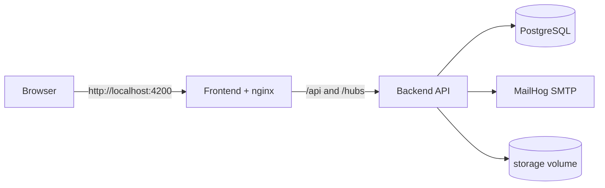

# Local full-stack environment

> Type: operations
> Scope: system
> Status: implemented
> Canonical for: Docker Compose services and local cross-module configuration

## Summary

- `docker-compose.yml` runs the frontend, backend, PostgreSQL, and MailHog.
- The browser uses the frontend nginx host; nginx proxies `/api/` and `/hubs/` to the backend.
- Compose overrides only settings that differ from local `dotnet run` / `ng serve`.
- Backend persistence, jobs, and file storage are documented with the backend module.

## Commands

Run from the repository root:

| Task | Command |
| --- | --- |
| Start in foreground | `npm run docker:up` |
| Start in background | `npm run docker:up:detached` |
| Follow logs | `npm run docker:logs` |
| Stop | `npm run docker:down` |
| Stop and remove local volumes | `npm run docker:down:volumes` |
| Rebuild images | `npm run docker:build` |
| Run backend tests in a container | `npm run docker:test:backend` |

The default endpoints are:

| Service | URL |
| --- | --- |
| Frontend | `http://localhost:4200` |
| Backend / Swagger | `http://localhost:5000` |
| Browser API path | `http://localhost:4200/api/v1` |

## Configuration precedence

The backend container uses `ASPNETCORE_ENVIRONMENT=Development` and loads, in order:

1. `appsettings.json`;
2. `appsettings.Development.json`;
3. environment variables from `docker-compose.yml`.

Compose overrides settings that differ inside containers, including the PostgreSQL host and `FileStorageOptions__RootPath=/app/storage`. Add Docker-only values as `Section__Property` environment entries rather than changing local-development defaults.

The frontend container writes `public/runtime-config.js` from `CHANGE_ME_API_URL`; the default stack uses `/api/v1`.

Never commit signing keys, SMTP credentials, or production database passwords. Use backend User Secrets for local host runs and environment variables or a secret manager for containers and deployments. The backend example is `src/Template.Backend/src/Template.Backend.Web/secrets.json.example`.

## Data and startup

- Development API startup applies pending migrations because `DatabaseOptions:ApplyMigrationsOnStartup` is enabled in `appsettings.Development.json`.
- The PostgreSQL and file-storage named volumes survive container restarts.
- `npm run docker:down:volumes` removes local Compose data; use it only when a clean local environment is intended.
- Optional demo data is generated separately with `npm run data:generate`.

## Related documents

| Topic | Document |
| --- | --- |
| EF Core and PostgreSQL | [Backend persistence](../../modules/backend/operations/persistence.md) |
| Hangfire | [Background jobs](../../modules/backend/operations/background-jobs.md) |
| Attachment bytes and backup | [File storage](../../modules/backend/operations/file-storage.md) |
| Demo dataset | [Demo data](../../modules/backend/demo-data.md) |
| Production and split-host setup | [Deployment](deployment.md) |
