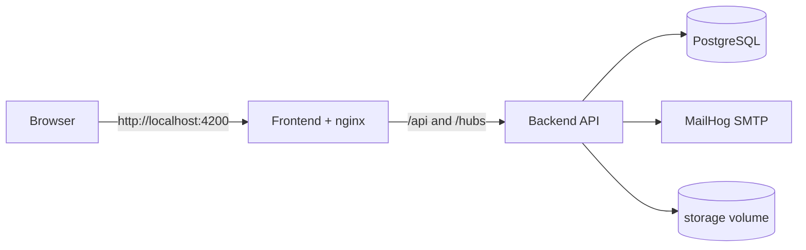

# Local full-stack environment

> Type: operations
> Scope: system
> Status: implemented
> Canonical for: Docker Compose services and local cross-module configuration

## Summary

- `docker-compose.yml` runs the frontend, backend, PostgreSQL, and MailHog.
- The browser uses the frontend nginx host; nginx proxies `/api/` and `/hubs/` to the backend.
- One ignored root `.env`, created from `.env.example`, supplies locally editable values to Compose and local .NET tooling.
- Compose passes only explicitly selected variables and keeps container-only topology in `docker-compose.yml`.
- Backend persistence, jobs, and file storage are documented with the backend module.



## Commands

`npm run setup` creates local configuration from `.env.example` when `.env` is missing and never overwrites an existing file. Review every placeholder and keep the resulting file outside source control:

```powershell
npm run setup
```

If dependencies are already installed and only the configuration file is needed, copy `.env.example` to `.env` manually.

Run from the repository root:

| Task | Command |
| --- | --- |
| Start in foreground | `npm run docker:up` |
| Start in background | `npm run docker:up:detached` |
| Follow logs | `npm run docker:logs` |
| Stop | `npm run docker:down` |
| Stop and remove local volumes | `npm run docker:down:volumes` |
| Rebuild images | `npm run docker:build` |
| Run backend tests in a container | `npm run docker:test:backend` |

The default endpoints are:

| Service | URL |
| --- | --- |
| Frontend | `http://localhost:4200` |
| Backend / Swagger | `http://localhost:5000` |
| Browser API path | `http://localhost:4200/api/v1` |

## Configuration precedence

The root `.env` owns PostgreSQL database/user/password, the JWT signing key, initial-administrator credentials, and optional SMTP credentials. It is developer convenience rather than encrypted storage: local processes, Docker inspection, and users with filesystem access may read the values.

Local .NET entry points load it only in `Development`, before normal configuration is built:

| Entry point | Loader behavior |
| --- | --- |
| API (`dotnet run` or IDE) | Searches the working directory and parents for `.env` |
| EF Core design-time factory | Uses the same parent traversal before building EF configuration |
| Demo-data generator | Uses the same loader before building its host |

`DotNetEnv` uses no-clobber behavior. Values already supplied by the shell, IDE, CI, or container remain authoritative; ASP.NET Core then maps `__` to configuration section separators.

The backend container uses `ASPNETCORE_ENVIRONMENT=Development` and receives configuration in this order:

1. `appsettings.json`;
2. `appsettings.Development.json`;
3. explicitly selected environment variables from `docker-compose.yml`.

Compose reads `.env` for `${VARIABLE}` interpolation but does not inject the whole file. It constructs the backend PostgreSQL connection with host `postgres`, sets SMTP host `mailhog`, and sets `FileStorageOptions__RootPath=/app/storage`. The database container receives only the PostgreSQL primitives. Required credentials use Compose required interpolation and fail before startup when absent.

The frontend container writes `public/runtime-config.js` from `CHANGE_ME_API_URL`; the default stack uses `/api/v1`.

Never commit `.env`, signing keys, SMTP credentials, database passwords, or initial-administrator passwords. `.dockerignore` also excludes environment files from Docker build contexts. Production does not load `.env`; see [Deployment](deployment.md) for protected server-side environment files.

## Startup validation

The API validates connection-string shape and all registered runtime option sections before migrations, recurring-job registration, or request handling. Errors name the invalid section and property. Validation does not test PostgreSQL, SMTP, or filesystem reachability; health checks and normal startup operations still own those checks.

## Data and startup

- Development API startup applies pending migrations because `DatabaseOptions:ApplyMigrationsOnStartup` is enabled in `appsettings.Development.json`.
- The PostgreSQL and file-storage named volumes survive container restarts.
- `npm run docker:down:volumes` removes local Compose data; use it only when a clean local environment is intended.
- Optional demo data is generated separately with `npm run data:generate`.

## Verification

After editing `.env`:

```powershell
docker compose config --quiet
npm run start:backend
```

Do not print resolved `docker compose config` output when the configuration may contain credentials.

## Related documents

| Topic | Document |
| --- | --- |
| EF Core and PostgreSQL | [Backend persistence](../../modules/backend/operations/persistence.md) |
| Hangfire | [Background jobs](../../modules/backend/operations/background-jobs.md) |
| Attachment bytes and backup | [File storage](../../modules/backend/operations/file-storage.md) |
| Demo dataset | [Demo data](../../modules/backend/demo-data.md) |
| Production and split-host setup | [Deployment](deployment.md) |
